# MicroPy_PlantMonitor

A plant monitor work with micropython and MQTT Home Assistant Integration.

## Features

- Basic environment detection, including temperature, pressure.
- Detect soil moisture and upload to Home Assistant platform automatically.
- Data display with 1602 LCD
- Wide device and MPU support and had been tested on TYPBoard V202 which ESP8266 inner.
- Support WI-FI and upload status display

https://github.com/user-attachments/assets/1d13734b-7d9a-4f98-9366-287bea55bc63

## How to use

The `/program/` is all need to copy to your board, for the assembly guide to see *Assembly Guide* chapter below. 

The `/library/` is drivers' source code. Here are general introduction. 

### HD44780 Driver

HD44780 is a matrix LCD controller. It has 8 pins and 4 pins communication methods, which differences that 4 pins need 
to transmit twice for single instruction and 8 pins need only once. To reduce pins needed, the display may use I²C 
convert board or called *Backpack*, and it maybe attached back. I²C is a BUS protocol that only use SCL and SDL pins. 
The I²C convert board will analyze the signal from SCL and SDL pins and set display pins level. HD44780 Driver's 
README.md introduce more, see [HD44780_Driver's Readme](/library/HD44780_Driver/README.md).

### BMP180 Sensor

BMP180 is a sensor which could detect temperature and pressure. BMP180 must use I²C BUS to communicate. BMP180 has 
varieties of register which stored calibration data. Every BMP180 has different calibration data and must read these 
data to fix temperature and pressure raw data. For how to read accurate data, refer to the *BMP180 datasheet*. 

## Assembly Guide

Here is a possible circuit diagram, with TPYBoard V202.



Here is pins' defined. Note that all pins in MicroPython are ESP8266's pins, please see your own board's user guide 
to learn which pins actually connect to ESP8266.

| Pins on ESP8266 | Pin Name on TPYBoard V202 | Note                                                                                           |
|:---------------:|:-------------------------:|:-----------------------------------------------------------------------------------------------|
|     GPIO14      |            SCL            | ESP8266 doesn't have I²C interface and need software to simulate or called *Software I²C Bus*. |
|      GPIO2      |            SDL            | ESP8266 doesn't have I²C interface and need software to simulate or called *Software I²C Bus*. |
|       ADC       |            ADC            | ESP8266 has one ADC or Analog to Digital Convertor. In MicroPython, it's called `ADC(0)` .     |

### BOM(Bill of Materials)

| Name                                 |     Model     | Number | Note                                                                                          | Datasheet                                                                                                                                                                     |
|:-------------------------------------|:-------------:|:------:|:----------------------------------------------------------------------------------------------|:------------------------------------------------------------------------------------------------------------------------------------------------------------------------------|
| ESP8266 Board                        | TPYBoard V202 |   1    | Other boards that MicroPython and I2C, ADC pins, network function supported can also be used. | [TPYBoard v202资料(CN Only)](http://old.tpyboard.com/downloads/docs/TPYBoard%20v202%E8%B5%84%E6%96%99.rar)                                                                      |
| 16*2 Matrix LCD Display              |     1602A     |   1    | Must HD44780 LCD Driver inner. Most 1602 LCD displays are driven by HD44780.                  | [1602A Datasheet](https://www.openhacks.com/uploadsproductos/eone-1602a1.pdf)</br>[HD44780 Datasheet](https://cdn.sparkfun.com/assets/9/5/f/7/b/HD44780.pdf)                  |             
| BMP180 Digital Pressure Sensor Board |     GY-89     |   1    | Other boards with BMP180 and I2C interface exposed are also OK.                               | [GY-89 Datasheet(CN Only)](https://pan.baidu.com/s/1uGhAvttzMSDVew6XG9XA7Q?pwd=8889)</br>[BMP180 Datasheet](https://cdn-shop.adafruit.com/datasheets/BST-BMP180-DS000-09.pdf) |
| I2C Covert Board for LCD             |               |   1    | Maybe attached back of the 1602 LCD display, or also called *backpack*.                       | [I2C LCD转接板(CN Only)](https://pan.baidu.com/s/1Yr74R8GVXv5tu8h7VaSlUQ?pwd=8888)</br>[PCF8574 Datasheet](https://www.ti.com/lit/ds/symlink/pcf8574.pdf)                        |
| Soil Moisture Sensor                 |  YL-69/YL-38  |   1    | Others that output the analog signal can also be used.                                        | [土壤湿度传感器(CN Only)](https://pan.baidu.com/s/1mhHIu2s)                                                                                                                          |

### Flash your board

If you had a flashed MicroPython board, jump and see next chapter. But too old firmware may cause unknown problem, 
recommending use latest firmware.

For official ESP8266 flashing guide, see 
[Getting started with MicroPython on the ESP8266](https://docs.micropython.org/en/latest/esp8266/tutorial/intro.html).

For other boards' flashing guide, see [MicroPython downloads](https://micropython.org/download/).

As for my experience, MicroPython on ESP8266 may cannot start up sometimes. If board have any problems when connect 
terminal or copy programs, re-flash firmware.

Here is simple guide that how to flash ESP8266.

- Before start, you need to check your own board that if it has any USB port and FLASH button. If not, you need a USB
converter to communicate with your board and may need to set level manually. Please reference to board's user guide.
- Go to [MicroPython website](https://micropython.org/download/ESP8266_GENERIC/) to download firmware. ESP8266's 
firmware is general. 


> [!NOTE]
> TYPBoard V202 and TYPBoard V102 are NOT same! TPYBoard V102 is base on STM32 and firmware is same as 
> pyboard v1.0 **(NOT pyboard v1.1)** . 

- Install CPython at [Python Downloads](https://www.python.org/downloads/). After installing, open your terminal or 
Windows called PowerShell, run `pip install esptool` to install flash tool.

> [!NOTE]
> This tool is for ESP series. For other boards or MPU please reference MicroPython download website.

> [!IMPORTANT]
> If show any info like `Command Not Found`, you need add CPython to your system's environment variable first.

- Then, disconnect board's power and press FLASH button. While pressing button, connect board to PC and run 
`esptool --port <YOUR_COM> erase_flash`. `<YOUR_COM>` is your actual COM, like `/dev/ttyUSB0` on Linux/macOS or `COM4`
for Windows. For ensure, run `ls /dev/` on Linux/macOS or open *Device Manager* on Windows.
- After erasing firmware, disconnect and reconnect while pressing FLASH button, then run 
`esptool --port <YOUR_COM> --baud 460800 write_flash --flash_size=detect 0 <YOUR_DOWNLOADED_FIRMWARE>`. 
`<YOUR_DOWNLOADED_FIRMWARE>` is path that ESP8266 firmware.
- All done!

### Copy Programs to Board

Only recommend the official tool `mpremote`. Use `pip install mpremote` to install. Here are example that you may need.

All command see at [MicroPython remote control: mpremote](https://docs.micropython.org/en/latest/reference/mpremote.html).

| Command                                                      | Note                                                                    |
|:-------------------------------------------------------------|:------------------------------------------------------------------------|
| `mpremote connect auto fs ls ":"`                            | Show all files in board's root                                          |
| `mpremote connect auto fs rm ":<PATH>"`                      | Remove file `<PATH>`.                                                   |
| `mpremote connect auto fs cp -r "<PATH>\." ":"`              | Copy all files to board's `<PATH>`.                                     |
| `mpremote connect auto fs cat ":<PATH>"`                     | Print file `<PATH>` content.                                            |
| `mpremote connect auto fs cp ":<BOARD_PATH>" "<LOCAL_PATH>"` | Download file `<BOARD_PATH>` from the board to local `<LOCAL_PATH>`.    |
| `mpremote connect auto repl`                                 | Enter board's REPL. This allow you to see `print()` or run python code. |

Generally, you only need copy files to your board in `/program/`. 

### Compiled Binary File `.mpy` (Optional)

You know, codes contain many unused lines, like comments. Although they won't run, they also take up valuable 
space. Compiled `.py`s to `.mpy` will reduce code size and improve performance without any change: just like use `.py`.

When you `import`, MicroPython will find `.mpy` first and if not found then find `.py`. In other words, `.py` and 
`.mpy` could exist together and MicroPython know which one should be called.

> [!IMPORTANT]
> `boot.py` and `main.py` is one part of boot process. MicroPython only call `boot.py` and `main.py`, not 
> `.mpy`.

To compile `.mpy` file before, recommend to read [MicroPython .mpy files](https://docs.micropython.org/en/latest/reference/mpyfiles.html).

Here is simple guide.

- Before starting, you need to ensure which `.mpy` that firmware support. Run below command on your board. This will 
display supported `.mpy` version.

```python
from sys import implementation as implement
print(f"supported_mpy_version = {implement._mpy & 0xff}.{implement._mpy >> 8 & 3}")
```

- Install `mpy-cross` using command `pip install mpy-cross==<FIRMWARE_RELEASE>` and replace `<FIRMWARE_RELEASE>` to 
firmware version that `.mpy` version compatible. Here is some examples, for more see [MicroPython .mpy files - Versioning and compatibility of .mpy files](https://docs.micropython.org/en/latest/reference/mpyfiles.html#versioning-and-compatibility-of-mpy-files).

|     `<FIRMWARE_RELEASE>`     | `supported_mpy_version` |
|:----------------------------:|:-----------------------:|
|           `1.23.0`           |           6.3           | 
| `1.22.0`, `1.22.1`, `1.22.2` |           6.2           |
|      `1.20.0`, `1.21.0`      |           6.1           |
|       `1.19`, `1.19.1`       |            6            |
| `1.12`, `1.13`, ..., `1.18`  |            5            |
|            `1.11`            |            4            |
|   `1.9.3`, `1.9.4`, `1.10`   |            3            |
|   `1.9`, `1.9.1`, `1.9.2`    |            2            |

- Run `mpy-cross <PY_FILE_PATH>` and replace `<PY_FILE_PATH>` to your `.py` file. Then a `.mpy` file will be created
at `.py` folder. Use `mpy-cross -o <OUTPUT_PATH> <PY_FILE_PATH>` to create in specific path.
- (Optional) You can also add `-O<NUMBER>` like `mpy-cross -O3 <PY_FILE_PATH>` for further optimization.

### Get Home Assistant and MQTT Broker

This program supports to upload data to Home Assistant by MQTT. Here is simple guide that run on local.

- If you have had Home Assistant and MQTT Integration, just change `main.py`'s top to your actual information:

```python
SSID = "<SSID_OR_WIFI_NAME>"
PASSWORD = "<WIFI_PASSWORD>"
MQTT_BROKER_IP = "<MQTT_BROKER_IP>"
MQTT_BROKER_PORT = <MQTT_BROKER_PORT>
```

- For MQTT Broker, recommend to use the mosquitto. To use Docker, run 
`docker run --name mosquitto --network host -d eclipse-mosquitto:latest` to install. This will expose all port and 
access all device that in network. Add `--restart=unless-stopped` to auto restart. 

> [!IMPORTANT]
> If you use the Docker Desktop, you need go to *Settings - Resources - Network* to enable *host networking*.

- By default, the mosquitto only listen localhost and port is 1883. To listen all host, edit config by running 
`docker exec -it --workdir "/mosquitto/" mosquitto vi "./config/mosquitto.conf"`.
- Add `listener 1883 0.0.0.0` at line 234, this will accept all request from any host to 1883 port. For 
more information see `/mosquitto/config/mosquitto.conf`'s instructions.
- Add `allow_anonymous true` at line 533, this will disable auth. For more information see 
`/mosquitto/config/mosquitto.conf`'s instructions.

> [!TIP]
> Docker Desktop should have a GUI editor. Go to *Containers - mosquitto(or your custom name) - Files* to edit.

- Then restart by running `docker restart mosquitto`.

> [!CAUTION]
> This guide is intended for use within a local area network (LAN) and assumes that the device is not 
> exposed to the public internet. If you need additional security measures, please refer to the configuration 
> file instructions, especially the section on ***"Certificate-based SSL/TLS support"*** (line 303 of 
> `/mosquitto/config/mosquitto.conf`).

- Install the Home Assistant, see at 
[Home Assistant Installation - Advanced installation methods](https://www.home-assistant.io/installation/#advanced-installation-methods).
Or use docker to install *Home Assistant Container*: 
`docker run --name homeassistant --network host -d homeassistant/home-assistant:latest`. This will expose all port and 
access all device that in network. Add `--restart=unless-stopped` to auto restart. Then access `localhost:8123` to 
finish setup.  

> [!CAUTION] 
> This guide is intended for use within a local area network (LAN) and assumes that the device is not 
> exposed to the public internet. If you need additional security measures, please refer to 
> [Home Assistant - Securing](https://www.home-assistant.io/docs/configuration/securing/).

- Go to the Home Assistant's `Settings - Devices & services - ADD INTERGRATION` and select MQTT. If your mosquitto at
the same device and didn't change port, that host is `127.0.0.1` and port is `1883`.
- When the display show upload  icon, you should see data at 
Home Assistant's Overview.

---------

## Special Thanks

- Thank [@Diviner2004](https://github.com/Diviner2004) to review Japanese HD44780 character set.