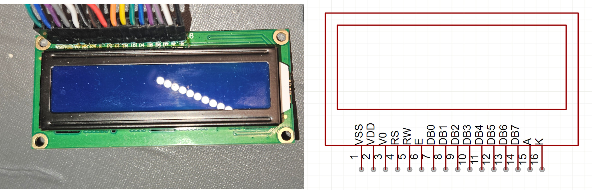
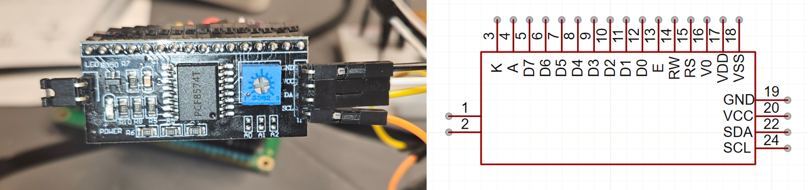

# HD44780_Driver

An MicroPython LCD driver for HD44780. 

HD44780 is a matrix LCD controller. It has 8 pins and 4 pins communication methods, which differences that 4 pins 
need to transmit twice for single instruction and 8 pins need only once. A typical LCD 1602A powered by HD44780 be like:



To reduce pins needed, the display may use I²C convert board or called Backpack, and it maybe attached back of the 
display. I²C is a BUS protocol that only use SCL and SDL pins. The I²C convert board will analyze the signal from 
SCL and SDL pins and set display pins level. A typical I²C convert board powered by PCF8574 be like:



An example or test see [`/program/lcd_control.py` in MicroPy_PlantMonitor](https://github.com/gaobobo/MicroPy_PlantMonitor/blob/master/program/lcd_control.py).

## How to use

Here are all files you need to copy to your board.

|                Files                 |  4 Pins   |  8 Pins   |         I2C          | Note                                                                                                                                                                                                               |
|:------------------------------------:|:---------:|:---------:|:--------------------:|:-------------------------------------------------------------------------------------------------------------------------------------------------------------------------------------------------------------------|
|        `./HAL/ABC_Gener_HAL`         |   Need    |   Need    |         Need         |                                                                                                                                                                                                                    |
|        `./HAL/ABC_GPIO4_HAL`         |   Need    |  No Need  |       No Need        |                                                                                                                                                                                                                    |
|        `./HAL/ABC_GPIO8_HAL`         |  No Need  |   Need    |       No Need        |                                                                                                                                                                                                                    |
|         `./HAL/ABC_I2C_HAL`          |  No Need  |  No Need  | Need and Must Extend | See example at [./HAL/pcf8574_I2C_HAL.py](./HAL/pcf8574_I2C_HAL.py).                                                                                                                                               |
| `./instruction/instruction_const.py` |   Need    |   Need    |         Need         |                                                                                                                                                                                                                    |
|        `./HD44780_Driver.py`         |   Need    |   Need    |         Need         |                                                                                                                                                                                                                    |
|         `./lcd_1602_api.py`          | Recommend | Recommend |      Recommend       | Achieve common functions and print the FrameBuffer object. See example at [`/program/lcd_control.py` in MicroPy_PlantMonitor](https://github.com/gaobobo/MicroPy_PlantMonitor/blob/master/program/lcd_control.py). |
|           Any Other Files            |  No Need  |  No Need  |       No Need        | Not Required. Some files may have specific functions, see below.                                                                                                                                                   |

### To Use Native Lib

Generally, you only need copy files and no need to extend HAL because default use `machine.Pin` to achieve, and it 
works on all ports. But if you want to use specific port's lib like `pyb.Pin`, you need extend HAL, see example at 
[`./HAL/pyb_GPIO4_HAL.py`](./HAL/pyb_GPIO4_HAL.py) and [`./HAL/pyb_GPIO8_HAL.py`](./HAL/pyb_GPIO8_HAL.py) 


### Print un-ASCII Char

The HD44780 has an inner Character Generator ROM which stored pre-defined characters. The ROM has three versions: 
Japanese, European, and others that customized. Just use `lcd_1602_api.print("\")`, if it shows `￥`, it's Japanese 
version, otherwise `\` is European version.

Some ASCII Codes maybe other characters, see `./char_sets/` learn more.

Because of limited memory, `lcd_1602_api.print()` function only support print ASCII characters(most). If you want to 
print all characters in ROM, you could use `lcd_1602_api.print_char()`. If your board has enough memory, change 
`./lcd_1602_api.py`'s header and copy character set file to board. Then you could use `lcd_1602_api.print()` to print 
un-ASCII characters.

### Print Custom Char

`lcd_1602_api` achieve print FrameBuffer object function `lcd_1602_api.write_custom_char()`. Example see 
[`/program/lcd_control.py` in MicroPy_PlantMonitor](https://github.com/gaobobo/MicroPy_PlantMonitor/blob/master/program/lcd_control.py).

### Animation

You could over-write for one character use `lcd_1602_api.write_custom_char()` to achieve animation, and display will 
update automatically.

Example see 
[`/program/lcd_control.py` in MicroPy_PlantMonitor](https://github.com/gaobobo/MicroPy_PlantMonitor/blob/master/program/lcd_control.py).

### All Instructions

Also provided HD44780's all instructions at `./instruction/instruction_dic.py`. Note that in memory limited board may 
cause out of memory. Use bit operations and `instruction_const.py` is wisely.

### Merge to a Single File

`mpy_compile.py` provide a tool to merge files. It could detect relatively import and copy file content to properly 
position. After all, it will create `.mpy` file.

Note that the single file means MicroPython need load whole file to memory, so please evaluate carefully before using.

```
usage: mpy_compile.py [-h] [-s SOURCE] [-o OUTPUT] [--opt {0,1,2,3}] [--encoding ENCODING]

merge file to single .py and compiled .mpy file.

options:
  -h, --help           show this help message and exit
  -s, --source SOURCE  source file path.
  -o, --output OUTPUT  Output file path. Default is ./build/output.py
  --opt {0,1,2,3}      Set optimistic mode. As same as mpy-cross -O[N]. Default is 3.
  --encoding ENCODING  Set encoding when write and read. Default is UTF-8.
```